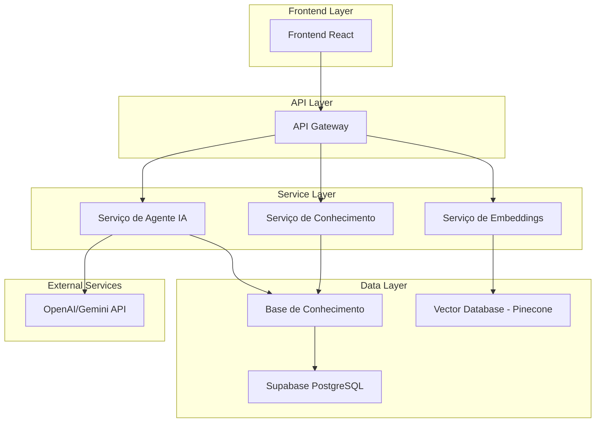
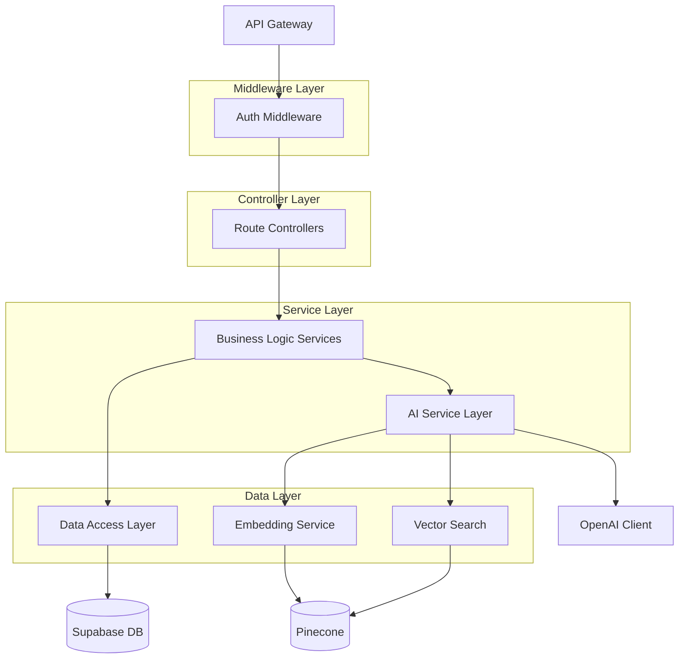
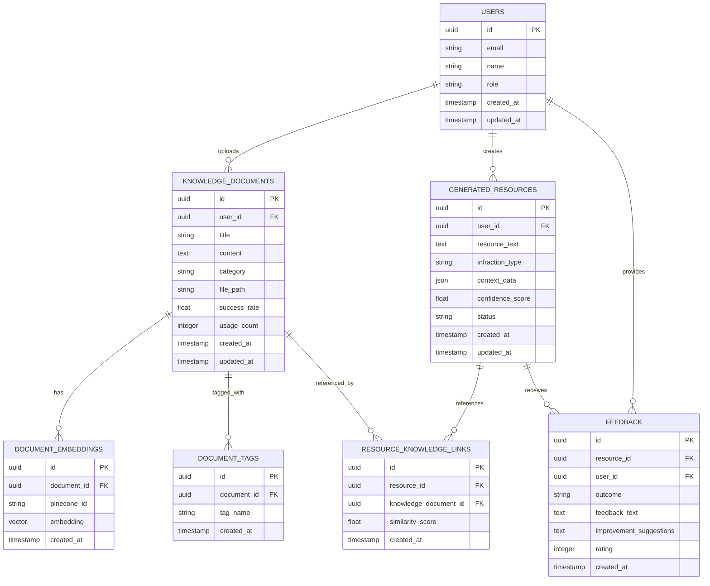

# Arquitetura Técnica - Sistema de Agente Jurídico Inteligente

## 1. Arquitetura Geral



## 2. Stack Tecnológico

* **Frontend**: React\@18 + TypeScript + TailwindCSS + Vite

* **Backend**: Node.js + Express\@4 + TypeScript

* **Banco de Dados**: Supabase (PostgreSQL) + Pinecone (Vector DB)

* **IA/ML**: OpenAI GPT-4 + Embeddings API + Gemini (fallback)

* **Autenticação**: Supabase Auth

* **Storage**: Supabase Storage (documentos)

* **Cache**: Redis (opcional para performance)

## 3. Definições de Rotas

| Rota            | Propósito                                            |
| --------------- | ---------------------------------------------------- |
| /dashboard      | Dashboard principal com métricas do agente           |
| /knowledge-base | Interface da base de conhecimento e busca            |
| /upload         | Interface para alimentar a base com novos documentos |
| /generator      | Gerador inteligente de recursos jurídicos            |
| /feedback       | Sistema de feedback e avaliação de recursos          |
| /admin          | Painel administrativo para gestão do sistema         |
| /profile        | Perfil do usuário e configurações                    |
| /analytics      | Métricas detalhadas e relatórios de performance      |

## 4. APIs do Backend

### 4.1 API de Conhecimento

**Upload de documento jurídico**

```
POST /api/knowledge/upload
```

Request:

| Parâmetro   | Tipo      | Obrigatório | Descrição                                             |
| ----------- | --------- | ----------- | ----------------------------------------------------- |
| file        | File      | true        | Arquivo PDF/DOC com conteúdo jurídico                 |
| category    | string    | true        | Categoria do documento (lei, jurisprudencia, recurso) |
| tags        | string\[] | false       | Tags para categorização                               |
| description | string    | false       | Descrição do documento                                |

Response:

| Parâmetro     | Tipo   | Descrição               |
| ------------- | ------ | ----------------------- |
| id            | string | ID único do documento   |
| status        | string | Status do processamento |
| embedding\_id | string | ID do embedding gerado  |

**Busca semântica na base**

```
GET /api/knowledge/search
```

Request:

| Parâmetro             | Tipo   | Obrigatório | Descrição                                |
| --------------------- | ------ | ----------- | ---------------------------------------- |
| query                 | string | true        | Texto da consulta                        |
| category              | string | false       | Filtro por categoria                     |
| limit                 | number | false       | Número máximo de resultados (padrão: 10) |
| similarity\_threshold | number | false       | Limiar de similaridade (padrão: 0.7)     |

Response:

```json
{
  "results": [
    {
      "id": "doc_123",
      "title": "Recurso CTB Art. 165",
      "content": "Texto do documento...",
      "similarity_score": 0.89,
      "category": "recurso",
      "success_rate": 0.75
    }
  ],
  "total": 25
}
```

### 4.2 API do Agente IA

**Geração de recurso inteligente**

```
POST /api/agent/generate-resource
```

Request:

| Parâmetro            | Tipo    | Obrigatório | Descrição                                |
| -------------------- | ------- | ----------- | ---------------------------------------- |
| infraction\_type     | string  | true        | Tipo da infração                         |
| context              | object  | true        | Contexto da infração (local, data, etc.) |
| user\_input          | string  | false       | Informações adicionais do usuário        |
| use\_knowledge\_base | boolean | true        | Se deve consultar a base de conhecimento |

Response:

```json
{
  "resource_text": "Texto do recurso gerado...",
  "confidence_score": 0.85,
  "similar_cases": [
    {
      "case_id": "case_456",
      "similarity": 0.92,
      "success_rate": 0.80
    }
  ],
  "legal_references": [
    "CTB Art. 165",
    "Resolução CONTRAN 432/13"
  ]
}
```

### 4.3 API de Feedback

**Registrar resultado de recurso**

```
POST /api/feedback/result
```

Request:

| Parâmetro                | Tipo   | Obrigatório | Descrição                            |
| ------------------------ | ------ | ----------- | ------------------------------------ |
| resource\_id             | string | true        | ID do recurso gerado                 |
| outcome                  | string | true        | Resultado (success, partial, failed) |
| feedback\_text           | string | false       | Comentários do usuário               |
| improvement\_suggestions | string | false       | Sugestões de melhoria                |

## 5. Arquitetura do Servidor



## 6. Modelo de Dados

### 6.1 Diagrama Entidade-Relacionamento



### 6.2 DDL (Data Definition Language)

**Tabela de Usuários**

```sql
-- Tabela de usuários (estende auth.users do Supabase)
CREATE TABLE public.user_profiles (
    id UUID PRIMARY KEY REFERENCES auth.users(id) ON DELETE CASCADE,
    email VARCHAR(255) NOT NULL,
    name VARCHAR(255) NOT NULL,
    role VARCHAR(50) DEFAULT 'user' CHECK (role IN ('user', 'admin', 'expert')),
    created_at TIMESTAMP WITH TIME ZONE DEFAULT NOW(),
    updated_at TIMESTAMP WITH TIME ZONE DEFAULT NOW()
);

-- RLS (Row Level Security)
ALTER TABLE public.user_profiles ENABLE ROW LEVEL SECURITY;
CREATE POLICY "Users can view own profile" ON public.user_profiles
    FOR SELECT USING (auth.uid() = id);
CREATE POLICY "Users can update own profile" ON public.user_profiles
    FOR UPDATE USING (auth.uid() = id);
```

**Tabela de Documentos de Conhecimento**

```sql
CREATE TABLE public.knowledge_documents (
    id UUID PRIMARY KEY DEFAULT gen_random_uuid(),
    user_id UUID REFERENCES public.user_profiles(id) ON DELETE CASCADE,
    title VARCHAR(500) NOT NULL,
    content TEXT NOT NULL,
    category VARCHAR(100) NOT NULL CHECK (category IN ('lei', 'jurisprudencia', 'recurso', 'doutrina')),
    file_path VARCHAR(1000),
    success_rate DECIMAL(3,2) DEFAULT 0.0,
    usage_count INTEGER DEFAULT 0,
    is_validated BOOLEAN DEFAULT FALSE,
    validated_by UUID REFERENCES public.user_profiles(id),
    created_at TIMESTAMP WITH TIME ZONE DEFAULT NOW(),
    updated_at TIMESTAMP WITH TIME ZONE DEFAULT NOW()
);

-- Índices para performance
CREATE INDEX idx_knowledge_documents_category ON public.knowledge_documents(category);
CREATE INDEX idx_knowledge_documents_success_rate ON public.knowledge_documents(success_rate DESC);
CREATE INDEX idx_knowledge_documents_created_at ON public.knowledge_documents(created_at DESC);

-- RLS
ALTER TABLE public.knowledge_documents ENABLE ROW LEVEL SECURITY;
CREATE POLICY "Public documents are viewable by all" ON public.knowledge_documents
    FOR SELECT USING (is_validated = true);
CREATE POLICY "Users can view own documents" ON public.knowledge_documents
    FOR SELECT USING (auth.uid() = user_id);
```

**Tabela de Embeddings**

```sql
CREATE TABLE public.document_embeddings (
    id UUID PRIMARY KEY DEFAULT gen_random_uuid(),
    document_id UUID REFERENCES public.knowledge_documents(id) ON DELETE CASCADE,
    pinecone_id VARCHAR(255) UNIQUE NOT NULL,
    embedding_model VARCHAR(100) DEFAULT 'text-embedding-ada-002',
    created_at TIMESTAMP WITH TIME ZONE DEFAULT NOW()
);

CREATE INDEX idx_document_embeddings_document_id ON public.document_embeddings(document_id);
CREATE INDEX idx_document_embeddings_pinecone_id ON public.document_embeddings(pinecone_id);
```

**Tabela de Recursos Gerados**

```sql
CREATE TABLE public.generated_resources (
    id UUID PRIMARY KEY DEFAULT gen_random_uuid(),
    user_id UUID REFERENCES public.user_profiles(id) ON DELETE CASCADE,
    resource_text TEXT NOT NULL,
    infraction_type VARCHAR(200) NOT NULL,
    context_data JSONB,
    confidence_score DECIMAL(3,2),
    status VARCHAR(50) DEFAULT 'pending' CHECK (status IN ('pending', 'submitted', 'successful', 'failed')),
    ai_model_used VARCHAR(100),
    created_at TIMESTAMP WITH TIME ZONE DEFAULT NOW(),
    updated_at TIMESTAMP WITH TIME ZONE DEFAULT NOW()
);

CREATE INDEX idx_generated_resources_user_id ON public.generated_resources(user_id);
CREATE INDEX idx_generated_resources_infraction_type ON public.generated_resources(infraction_type);
CREATE INDEX idx_generated_resources_status ON public.generated_resources(status);
```

**Tabela de Feedback**

```sql
CREATE TABLE public.feedback (
    id UUID PRIMARY KEY DEFAULT gen_random_uuid(),
    resource_id UUID REFERENCES public.generated_resources(id) ON DELETE CASCADE,
    user_id UUID REFERENCES public.user_profiles(id) ON DELETE CASCADE,
    outcome VARCHAR(50) NOT NULL CHECK (outcome IN ('success', 'partial', 'failed')),
    feedback_text TEXT,
    improvement_suggestions TEXT,
    rating INTEGER CHECK (rating >= 1 AND rating <= 5),
    created_at TIMESTAMP WITH TIME ZONE DEFAULT NOW()
);

CREATE INDEX idx_feedback_resource_id ON public.feedback(resource_id);
CREATE INDEX idx_feedback_outcome ON public.feedback(outcome);
CREATE INDEX idx_feedback_rating ON public.feedback(rating DESC);
```

**Dados Iniciais**

```sql
-- Inserir categorias padrão
INSERT INTO public.knowledge_documents (title, content, category, is_validated, success_rate)
VALUES 
    ('CTB Art. 165 - Dirigir sob influência de álcool', 'Texto completo do artigo 165...', 'lei', true, 0.85),
    ('Jurisprudência STJ - Recurso Especial 1.234.567', 'Ementa e acórdão...', 'jurisprudencia', true, 0.90),
    ('Modelo de Recurso - Excesso de Velocidade', 'Excelentíssimo Senhor...', 'recurso', true, 0.75);
```

## 7. Integração com Serviços de IA

### 7.1 Configuração OpenAI

```typescript
// services/openai.service.ts
import OpenAI from 'openai';

class OpenAIService {
  private client: OpenAI;
  
  constructor() {
    this.client = new OpenAI({
      apiKey: process.env.OPENAI_API_KEY
    });
  }
  
  async generateEmbedding(text: string): Promise<number[]> {
    const response = await this.client.embeddings.create({
      model: 'text-embedding-ada-002',
      input: text
    });
    return response.data[0].embedding;
  }
  
  async generateResource(prompt: string, context: any[]): Promise<string> {
    const systemPrompt = `Você é um especialista em direito de trânsito brasileiro. 
    Use o contexto fornecido para gerar um recurso jurídico preciso e fundamentado.`;
    
    const response = await this.client.chat.completions.create({
      model: 'gpt-4',
      messages: [
        { role: 'system', content: systemPrompt },
        { role: 'user', content: prompt }
      ],
      temperature: 0.3
    });
    
    return response.choices[0].message.content;
  }
}
```

### 7.2 Integração Pinecone

```typescript
// services/vector.service.ts
import { Pinecone } from '@pinecone-database/pinecone';

class VectorService {
  private pinecone: Pinecone;
  private indexName = 'legal-knowledge';
  
  constructor() {
    this.pinecone = new Pinecone({
      apiKey: process.env.PINECONE_API_KEY
    });
  }
  
  async upsertDocument(id: string, embedding: number[], metadata: any) {
    const index = this.pinecone.index(this.indexName);
    await index.upsert([{
      id,
      values: embedding,
      metadata
    }]);
  }
  
  async searchSimilar(queryEmbedding: number[], topK: number = 10) {
    const index = this.pinecone.index(this.indexName);
    const results = await index.query({
      vector: queryEmbedding,
      topK,
      includeMetadata: true
    });
    return results.matches;
  }
}
```

