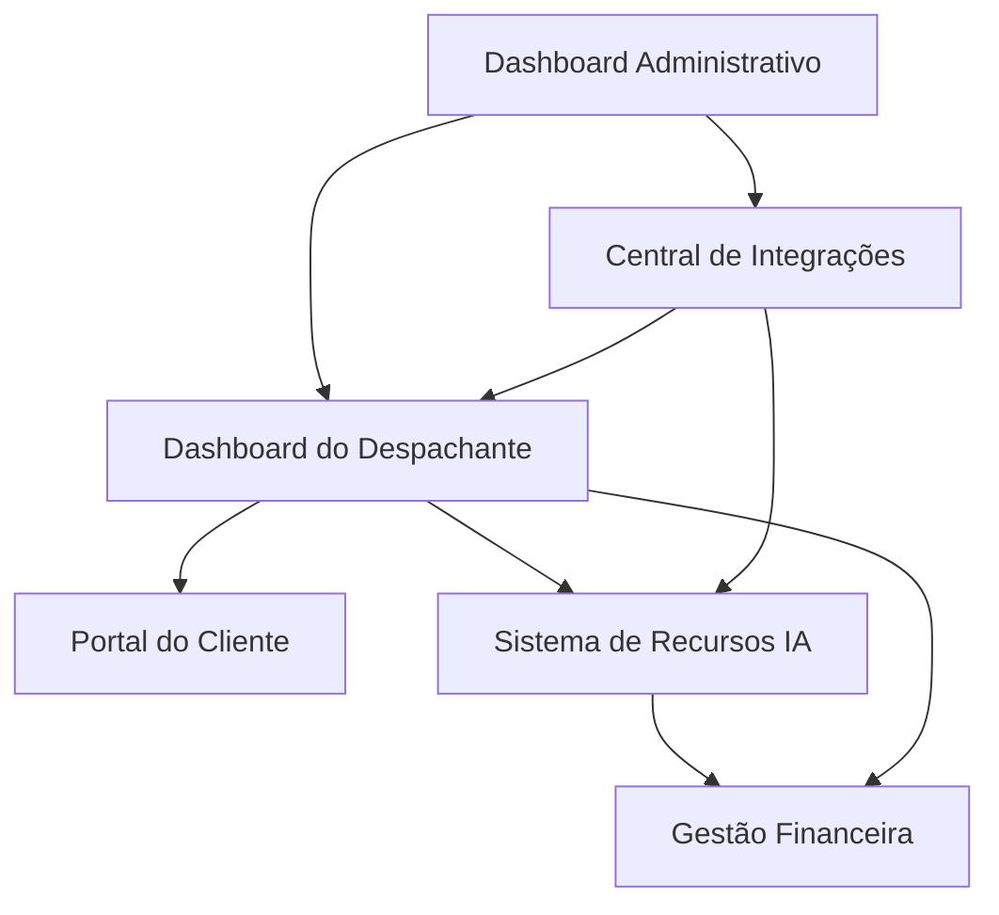

# SaaS Multiempresas - Recursos de Multas Automatizados

## 1. Product Overview

Plataforma SaaS multitenancy que permite despachantes automatizarem recursos de multas utilizando inteligência artificial, oferecendo uma solução completa para gestão hierárquica entre empresa principal, despachantes e clientes finais.

O sistema resolve o problema da complexidade e morosidade na criação de recursos de multas, permitindo que despachantes aumentem sua produtividade e taxa de sucesso através de automação inteligente e análise preditiva.

O produto visa capturar o mercado de despachantes brasileiros, com projeção de receita de R$ 400-600k mensais em 12 meses.

## 2. Core Features

### 2.1 User Roles

| Role | Registration Method | Core Permissions |
|------|---------------------|------------------|
| Empresa Principal | Acesso administrativo direto | Gestão completa da plataforma, configuração de planos, monitoramento global |
| Despachante | Cadastro via empresa principal com plano de assinatura | Gestão de clientes, criação de recursos, relatórios financeiros |
| Cliente Final | Cadastro via despachante | Visualização de multas, acompanhamento de recursos, acesso a documentos |

### 2.2 Feature Module

Nossos requisitos do SaaS de multas consistem nas seguintes páginas principais:

1. **Dashboard Administrativo**: painel de controle da empresa principal, gestão de despachantes, monitoramento de uso da plataforma.
2. **Dashboard do Despachante**: gestão de clientes finais, criação e acompanhamento de recursos, relatórios financeiros.
3. **Portal do Cliente**: visualização de multas, status de recursos, histórico de processos.
4. **Sistema de Recursos IA**: análise automática de multas, geração de recursos, templates inteligentes.
5. **Gestão Financeira**: controle de planos, cobrança, relatórios de faturamento.
6. **Central de Integrações**: conexão com DETRAN, DNIT, prefeituras, JARI/CETRAN.

### 2.3 Page Details

| Page Name | Module Name | Feature description |
|-----------|-------------|---------------------|
| Dashboard Administrativo | Gestão de Empresas | Cadastrar, editar e monitorar despachantes, definir planos de assinatura, visualizar métricas globais |
| Dashboard Administrativo | Relatórios Consolidados | Gerar relatórios financeiros, análise de uso da plataforma, métricas de performance por despachante |
| Dashboard Administrativo | Configuração de Sistema | Definir preços de planos, configurar integrações, gerenciar atualizações e backup |
| Dashboard do Despachante | Gestão de Clientes | Cadastrar clientes finais, importar dados de veículos, gerenciar documentos e comunicação |
| Dashboard do Despachante | Gestão de Recursos | Visualizar multas pendentes, criar recursos via IA, acompanhar status de processos, histórico de recursos |
| Dashboard do Despachante | Controle Financeiro | Gerar cobranças para clientes, controlar limites do plano, visualizar relatórios de faturamento |
| Portal do Cliente | Visualização de Multas | Exibir multas ativas, histórico de infrações, documentos relacionados |
| Portal do Cliente | Acompanhamento de Recursos | Mostrar status de recursos em andamento, notificações de atualizações, documentos gerados |
| Sistema de Recursos IA | Análise de Multas | Classificar tipo de infração, calcular probabilidade de sucesso, identificar argumentos aplicáveis |
| Sistema de Recursos IA | Geração Automática | Criar recursos usando templates inteligentes, personalizar argumentos, gerar documentação legal |
| Sistema de Recursos IA | Análise Preditiva | Estimar taxa de sucesso, calcular tempo de processo, análise de custo-benefício |
| Gestão Financeira | Controle de Planos | Gerenciar assinaturas, controlar limites de recursos, calcular cobranças adicionais |
| Gestão Financeira | Relatórios Financeiros | Gerar relatórios de faturamento, análise de lucratividade, previsão de receita |
| Central de Integrações | Conexões com Órgãos | Integrar com DETRAN, DNIT, prefeituras, sincronizar dados automaticamente |
| Central de Integrações | Automações | Verificar novas multas diariamente, enviar notificações, gerar procurações automáticas |

## 3. Core Process

**Fluxo da Empresa Principal:**
A empresa principal acessa o dashboard administrativo, cadastra novos despachantes, define planos de assinatura, monitora o uso da plataforma e gera relatórios consolidados.

**Fluxo do Despachante:**
O despachante faz login no sistema, cadastra clientes finais, importa dados de multas via integração, utiliza a IA para gerar recursos automaticamente, acompanha o status dos processos e gera cobranças para os clientes.

**Fluxo do Cliente Final:**
O cliente acessa o portal, visualiza suas multas pendentes, acompanha o status dos recursos criados pelo despachante e baixa documentos gerados.

**Fluxo de Automação IA:**
O sistema recebe dados de multas via integração, a IA analisa e classifica a infração, gera automaticamente o recurso com argumentos personalizados, o despachante revisa e aprova, e o sistema envia o recurso ao órgão competente.

## 4. User Interface Design

### 4.1 Design Style

- **Cores primárias:** Azul corporativo (#2563EB), verde sucesso (#10B981)
- **Cores secundárias:** Cinza neutro (#6B7280), branco (#FFFFFF), vermelho alerta (#EF4444)
- **Estilo de botões:** Arredondados com sombra sutil, efeito hover suave
- **Fontes:** Inter para textos gerais (14-16px), Roboto Mono para dados numéricos (12-14px)
- **Layout:** Design baseado em cards com navegação lateral, grid responsivo
- **Ícones:** Lucide icons com estilo minimalista, ícones de status coloridos para processos

### 4.2 Page Design Overview

| Page Name | Module Name | UI Elements |
|-----------|-------------|-------------|
| Dashboard Administrativo | Gestão de Empresas | Cards com métricas principais, tabela de despachantes com filtros, gráficos de crescimento em tempo real |
| Dashboard Administrativo | Relatórios Consolidados | Gráficos interativos (Chart.js), filtros de data, exportação PDF/Excel, KPIs em destaque |
| Dashboard do Despachante | Gestão de Clientes | Lista de clientes com busca, formulário modal para cadastro, upload de documentos drag-and-drop |
| Dashboard do Despachante | Gestão de Recursos | Timeline de processos, badges de status coloridos, botões de ação rápida, filtros avançados |
| Portal do Cliente | Visualização de Multas | Cards de multas com ícones de tipo, progress bar para recursos, notificações em tempo real |
| Sistema de Recursos IA | Análise de Multas | Interface de análise com score de sucesso, argumentos sugeridos em chips, preview do recurso |
| Gestão Financeira | Controle de Planos | Tabela de assinaturas, medidores de uso, alertas de limite, botões de upgrade |
| Central de Integrações | Conexões com Órgãos | Status de conexão com indicadores visuais, logs de sincronização, configurações de API |

### 4.3 Responsiveness

O produto é desktop-first com adaptação mobile completa. Interface otimizada para touch em tablets e smartphones, com navegação por menu hambúrguer e cards empilháveis em telas menores.