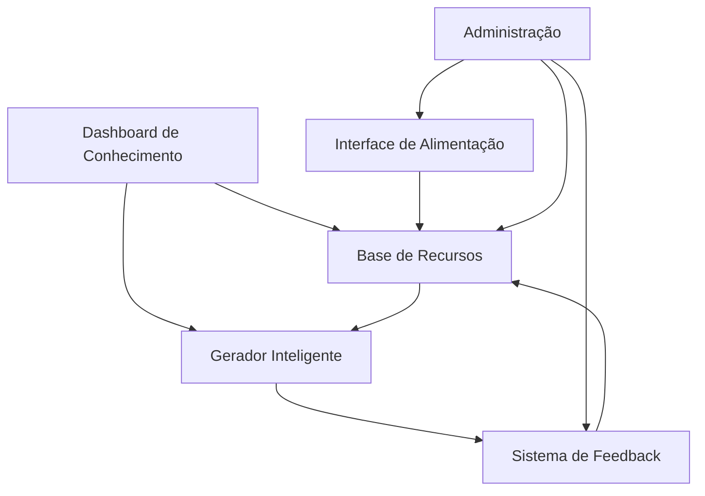

# Sistema de Agente Jurídico Inteligente com Base de Conhecimento

## 1. Visão Geral do Produto

Sistema de inteligência artificial especializado em direito de trânsito que aprende continuamente através de uma base de conhecimento jurídica alimentada pelos próprios usuários da plataforma. O agente consulta recursos anteriores bem-sucedidos, jurisprudências e leis para gerar defesas mais precisas e eficazes.

O sistema resolve o problema da inconsistência na qualidade dos recursos gerados, permitindo que a IA aprenda com casos reais de sucesso e se torne progressivamente mais especializada no domínio jurídico específico.

## 2. Funcionalidades Principais

### 2.1 Papéis de Usuário

| Papel | Método de Registro | Permissões Principais |
|-------|-------------------|----------------------|
| Usuário Padrão | Registro por email | Gerar recursos, consultar base pública |
| Administrador | Convite interno | Gerenciar base de conhecimento, moderar conteúdo |
| Especialista Jurídico | Validação profissional | Validar recursos, contribuir com jurisprudências |

### 2.2 Módulos Funcionais

Nosso sistema de agente jurídico inteligente consiste nas seguintes páginas principais:

1. **Dashboard de Conhecimento**: painel de controle, métricas de aprendizado, estatísticas de sucesso
2. **Base de Recursos**: biblioteca de recursos, sistema de busca avançada, filtros por categoria
3. **Interface de Alimentação**: upload de documentos, categorização automática, validação de conteúdo
4. **Gerador Inteligente**: criação de recursos, consulta à base, sugestões contextuais
5. **Sistema de Feedback**: avaliação de recursos, marcação de sucessos, aprendizado contínuo
6. **Administração**: gerenciamento de usuários, moderação de conteúdo, configurações do sistema

### 2.3 Detalhes das Páginas

| Nome da Página | Nome do Módulo | Descrição da Funcionalidade |
|----------------|----------------|-----------------------------|
| Dashboard de Conhecimento | Painel de Métricas | Exibir estatísticas de performance do agente, taxa de sucesso dos recursos, evolução do aprendizado |
| Dashboard de Conhecimento | Indicadores de Qualidade | Mostrar métricas de qualidade da base de conhecimento, cobertura de temas jurídicos |
| Base de Recursos | Biblioteca Digital | Armazenar e organizar recursos jurídicos, leis, jurisprudências e casos de sucesso |
| Base de Recursos | Sistema de Busca Semântica | Implementar busca por similaridade usando embeddings, filtros avançados por tipo de infração |
| Interface de Alimentação | Upload Inteligente | Processar documentos PDF/DOC, extrair texto e metadados, categorizar automaticamente |
| Interface de Alimentação | Validação de Conteúdo | Verificar qualidade e relevância do conteúdo, detectar duplicatas, validar formatação |
| Gerador Inteligente | Consulta Contextual | Buscar recursos similares na base antes da geração, identificar padrões de sucesso |
| Gerador Inteligente | Geração Assistida | Criar recursos usando IA + base de conhecimento, sugerir argumentos baseados em casos similares |
| Sistema de Feedback | Avaliação de Resultados | Coletar feedback sobre eficácia dos recursos, marcar sucessos e fracassos |
| Sistema de Feedback | Aprendizado Contínuo | Atualizar modelo baseado no feedback, ajustar pesos dos embeddings |
| Administração | Gestão de Conteúdo | Moderar uploads, gerenciar categorias, configurar parâmetros do agente |
| Administração | Controle de Qualidade | Monitorar performance do sistema, gerenciar usuários especialistas |

## 3. Fluxo Principal de Operação

**Fluxo do Usuário Padrão:**
1. Usuário acessa o Gerador Inteligente para criar um novo recurso
2. Sistema consulta automaticamente a base de conhecimento para casos similares
3. Agente gera recurso combinando IA com conhecimento da base
4. Usuário revisa e submete o recurso
5. Após resultado, usuário fornece feedback sobre eficácia
6. Sistema aprende e atualiza base de conhecimento

**Fluxo do Administrador:**
1. Administrador acessa Interface de Alimentação
2. Faz upload de novos documentos jurídicos (leis, jurisprudências)
3. Sistema processa e categoriza automaticamente
4. Administrador valida e aprova conteúdo
5. Conteúdo é integrado à base de conhecimento
6. Agente passa a utilizar novo conhecimento

## 4. Design da Interface

### 4.1 Estilo de Design

- **Cores primárias**: Azul profissional (#1e40af), Verde sucesso (#059669)
- **Cores secundárias**: Cinza neutro (#6b7280), Laranja alerta (#ea580c)
- **Estilo de botões**: Arredondados com sombra sutil, efeito hover suave
- **Fontes**: Inter para interface (14-16px), Roboto Mono para código (12px)
- **Layout**: Design baseado em cards com navegação lateral, grid responsivo
- **Ícones**: Lucide React com estilo minimalista, ícones de conhecimento e IA

### 4.2 Visão Geral do Design das Páginas

| Nome da Página | Nome do Módulo | Elementos de UI |
|----------------|----------------|----------------|
| Dashboard de Conhecimento | Painel de Métricas | Cards com gráficos de linha e barras, cores verde/azul, animações suaves de carregamento |
| Base de Recursos | Sistema de Busca | Barra de busca com autocomplete, filtros em sidebar, cards de resultado com preview |
| Interface de Alimentação | Upload Inteligente | Área de drag & drop estilizada, progress bars, badges de categoria automática |
| Gerador Inteligente | Consulta Contextual | Split view com recursos similares à esquerda, editor principal à direita |
| Sistema de Feedback | Avaliação de Resultados | Sistema de rating com estrelas, comentários expandíveis, badges de status |
| Administração | Gestão de Conteúdo | Tabelas com ações inline, modais de confirmação, indicadores de status coloridos |

### 4.3 Responsividade

Sistema desktop-first com adaptação mobile completa. Interface otimizada para touch em tablets, com navegação por gestos e componentes redimensionáveis para diferentes tamanhos de tela.