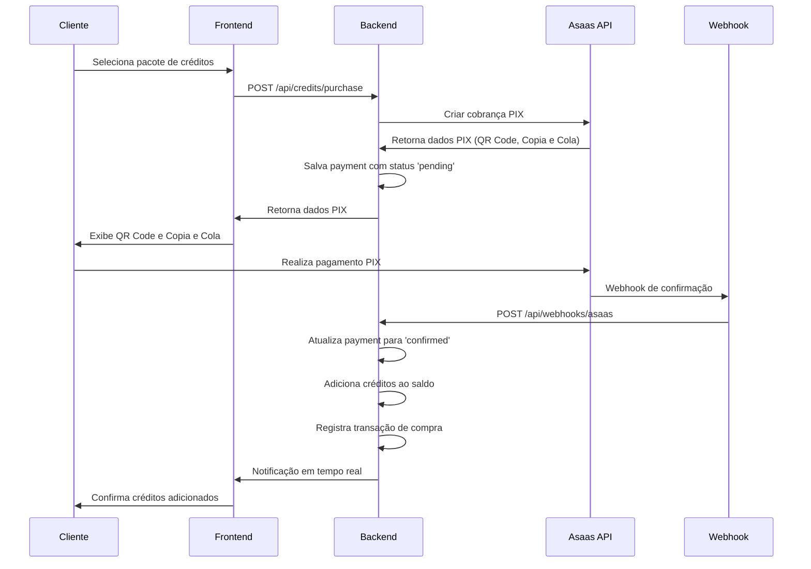

# Sistema de Créditos e Cobrança por Serviços

## 1. Visão Geral do Sistema

O sistema implementa um modelo de **pagamento pré-pago** onde clientes devem adquirir créditos antes de utilizar serviços. O fluxo inclui:

- **Cobrança PIX** via Asaas para aquisição de créditos
- **Validação de saldo** antes da execução de serviços
- **Sistema de créditos para despachantes** com desconto
- **Flexibilidade** para usar créditos do cliente ou despachante

## 2. Arquitetura de Banco de Dados

### 2.1 Tabela de Créditos (credits)

```sql
CREATE TABLE credits (
    id UUID PRIMARY KEY DEFAULT gen_random_uuid(),
    owner_type VARCHAR(20) NOT NULL CHECK (owner_type IN ('client', 'company')),
    owner_id UUID NOT NULL, -- client_id ou company_id
    balance DECIMAL(10,2) NOT NULL DEFAULT 0.00,
    total_purchased DECIMAL(10,2) NOT NULL DEFAULT 0.00,
    total_used DECIMAL(10,2) NOT NULL DEFAULT 0.00,
    created_at TIMESTAMP WITH TIME ZONE DEFAULT NOW(),
    updated_at TIMESTAMP WITH TIME ZONE DEFAULT NOW(),
    
    CONSTRAINT credits_balance_positive CHECK (balance >= 0),
    UNIQUE(owner_type, owner_id)
);

CREATE INDEX idx_credits_owner ON credits(owner_type, owner_id);
```

### 2.2 Tabela de Transações (credit_transactions)

```sql
CREATE TABLE credit_transactions (
    id UUID PRIMARY KEY DEFAULT gen_random_uuid(),
    credit_id UUID NOT NULL REFERENCES credits(id),
    transaction_type VARCHAR(20) NOT NULL CHECK (transaction_type IN ('purchase', 'usage', 'refund', 'transfer')),
    amount DECIMAL(10,2) NOT NULL,
    balance_before DECIMAL(10,2) NOT NULL,
    balance_after DECIMAL(10,2) NOT NULL,
    service_id UUID REFERENCES services(id), -- Para transações de uso
    payment_id UUID REFERENCES payments(id), -- Para transações de compra
    description TEXT,
    metadata JSONB,
    created_at TIMESTAMP WITH TIME ZONE DEFAULT NOW(),
    created_by UUID REFERENCES users(id)
);

CREATE INDEX idx_credit_transactions_credit_id ON credit_transactions(credit_id);
CREATE INDEX idx_credit_transactions_type ON credit_transactions(transaction_type);
CREATE INDEX idx_credit_transactions_created_at ON credit_transactions(created_at DESC);
```

### 2.3 Tabela de Pagamentos (payments)

```sql
CREATE TABLE payments (
    id UUID PRIMARY KEY DEFAULT gen_random_uuid(),
    asaas_payment_id VARCHAR(100) UNIQUE,
    customer_id UUID NOT NULL REFERENCES clients(id),
    company_id UUID NOT NULL REFERENCES companies(id),
    amount DECIMAL(10,2) NOT NULL,
    credit_amount DECIMAL(10,2) NOT NULL, -- Créditos que serão adicionados
    discount_percentage DECIMAL(5,2) DEFAULT 0.00,
    payment_method VARCHAR(20) NOT NULL DEFAULT 'PIX',
    status VARCHAR(20) NOT NULL DEFAULT 'pending' CHECK (status IN ('pending', 'confirmed', 'cancelled', 'expired')),
    pix_qr_code TEXT,
    pix_copy_paste TEXT,
    due_date DATE NOT NULL,
    confirmed_at TIMESTAMP WITH TIME ZONE,
    asaas_webhook_data JSONB,
    created_at TIMESTAMP WITH TIME ZONE DEFAULT NOW(),
    updated_at TIMESTAMP WITH TIME ZONE DEFAULT NOW()
);

CREATE INDEX idx_payments_customer_id ON payments(customer_id);
CREATE INDEX idx_payments_company_id ON payments(company_id);
CREATE INDEX idx_payments_status ON payments(status);
CREATE INDEX idx_payments_asaas_id ON payments(asaas_payment_id);
```

### 2.4 Tabela de Pacotes de Créditos (credit_packages)

```sql
CREATE TABLE credit_packages (
    id UUID PRIMARY KEY DEFAULT gen_random_uuid(),
    name VARCHAR(100) NOT NULL,
    description TEXT,
    credit_amount DECIMAL(10,2) NOT NULL,
    price DECIMAL(10,2) NOT NULL,
    discount_percentage DECIMAL(5,2) DEFAULT 0.00,
    target_type VARCHAR(20) NOT NULL CHECK (target_type IN ('client', 'company')),
    is_active BOOLEAN DEFAULT true,
    created_at TIMESTAMP WITH TIME ZONE DEFAULT NOW(),
    updated_at TIMESTAMP WITH TIME ZONE DEFAULT NOW()
);

CREATE INDEX idx_credit_packages_target_type ON credit_packages(target_type);
CREATE INDEX idx_credit_packages_active ON credit_packages(is_active);
```

## 3. Fluxo de Cobrança PIX via Asaas

### 3.1 Processo de Compra de Créditos



### 3.2 API de Compra de Créditos

```typescript
// POST /api/credits/purchase
interface PurchaseCreditRequest {
  packageId: string;
  customerId: string;
  companyId: string;
}

interface PurchaseCreditResponse {
  paymentId: string;
  amount: number;
  creditAmount: number;
  pixQrCode: string;
  pixCopyPaste: string;
  dueDate: string;
  status: 'pending';
}
```

## 4. Sistema de Validação de Saldo

### 4.1 Verificação Antes da Execução

```typescript
interface ServiceExecutionRequest {
  serviceId: string;
  clientId: string;
  companyId: string;
  useCompanyCredits?: boolean; // Usar créditos da empresa
}

class CreditService {
  async validateAndDebitCredits(request: ServiceExecutionRequest): Promise<boolean> {
    // 1. Buscar preço do serviço
    const servicePrice = await this.getServicePrice(request.serviceId, request.companyId);
    
    // 2. Verificar saldo disponível
    const availableBalance = await this.getAvailableBalance(
      request.clientId, 
      request.companyId, 
      request.useCompanyCredits
    );
    
    // 3. Validar saldo suficiente
    if (availableBalance < servicePrice) {
      throw new InsufficientCreditsError('Saldo insuficiente para executar o serviço');
    }
    
    // 4. Debitar créditos
    await this.debitCredits(
      request.clientId,
      request.companyId,
      servicePrice,
      request.serviceId,
      request.useCompanyCredits
    );
    
    return true;
  }
}
```

### 4.2 Lógica de Prioridade de Créditos

```typescript
async getAvailableBalance(
  clientId: string, 
  companyId: string, 
  useCompanyCredits: boolean = false
): Promise<number> {
  if (useCompanyCredits) {
    // Priorizar créditos da empresa
    const companyBalance = await this.getCompanyBalance(companyId);
    const clientBalance = await this.getClientBalance(clientId);
    return companyBalance + clientBalance;
  } else {
    // Usar apenas créditos do cliente
    return await this.getClientBalance(clientId);
  }
}
```

## 5. Interface de Compra de Créditos

### 5.1 Componente de Seleção de Pacotes

```typescript
interface CreditPackage {
  id: string;
  name: string;
  description: string;
  creditAmount: number;
  price: number;
  discountPercentage: number;
  targetType: 'client' | 'company';
}

function CreditPurchaseModal({ isOpen, onClose, targetType }: {
  isOpen: boolean;
  onClose: () => void;
  targetType: 'client' | 'company';
}) {
  const [packages, setPackages] = useState<CreditPackage[]>([]);
  const [selectedPackage, setSelectedPackage] = useState<CreditPackage | null>(null);
  const [paymentData, setPaymentData] = useState<any>(null);
  
  // Implementação do componente
}
```

### 5.2 Exibição de Saldo

```typescript
function CreditBalance({ clientId, companyId }: {
  clientId: string;
  companyId: string;
}) {
  const [clientBalance, setClientBalance] = useState(0);
  const [companyBalance, setCompanyBalance] = useState(0);
  
  return (
    <div className="credit-balance">
      <div className="client-credits">
        <h3>Créditos do Cliente</h3>
        <span className="balance">R$ {clientBalance.toFixed(2)}</span>
      </div>
      
      <div className="company-credits">
        <h3>Créditos da Empresa</h3>
        <span className="balance">R$ {companyBalance.toFixed(2)}</span>
      </div>
      
      <button onClick={() => openPurchaseModal('client')}>
        Comprar Créditos Cliente
      </button>
      
      <button onClick={() => openPurchaseModal('company')}>
        Comprar Créditos Empresa
      </button>
    </div>
  );
}
```

## 6. Relatórios Financeiros

### 6.1 Dashboard de Créditos

```sql
-- Query para relatório de créditos por empresa
SELECT 
    c.name as company_name,
    cr.balance as current_balance,
    cr.total_purchased,
    cr.total_used,
    COUNT(ct.id) as total_transactions,
    SUM(CASE WHEN ct.transaction_type = 'purchase' THEN ct.amount ELSE 0 END) as total_purchases,
    SUM(CASE WHEN ct.transaction_type = 'usage' THEN ct.amount ELSE 0 END) as total_usage
FROM companies c
LEFT JOIN credits cr ON cr.owner_id = c.id AND cr.owner_type = 'company'
LEFT JOIN credit_transactions ct ON ct.credit_id = cr.id
GROUP BY c.id, c.name, cr.balance, cr.total_purchased, cr.total_used
ORDER BY cr.balance DESC;
```

### 6.2 Relatório de Transações

```typescript
interface TransactionReport {
  period: 'daily' | 'weekly' | 'monthly';
  startDate: string;
  endDate: string;
  companyId?: string;
  transactionType?: 'purchase' | 'usage' | 'refund';
}

class ReportService {
  async getCreditTransactionReport(filters: TransactionReport) {
    // Implementar query com filtros
    // Retornar dados agregados para gráficos
  }
  
  async getPaymentReport(filters: TransactionReport) {
    // Relatório de pagamentos PIX
    // Status, valores, conversão
  }
}
```

## 7. Integração com Serviços Existentes

### 7.1 Middleware de Validação

```typescript
// Middleware para validar créditos antes de executar serviços
export const validateCreditsMiddleware = async (
  req: Request,
  res: Response,
  next: NextFunction
) => {
  try {
    const { serviceId, clientId, companyId, useCompanyCredits } = req.body;
    
    await creditService.validateAndDebitCredits({
      serviceId,
      clientId,
      companyId,
      useCompanyCredits
    });
    
    next();
  } catch (error) {
    if (error instanceof InsufficientCreditsError) {
      return res.status(402).json({
        error: 'Créditos insuficientes',
        message: error.message,
        requiredCredits: error.requiredAmount,
        availableCredits: error.availableAmount
      });
    }
    
    next(error);
  }
};
```

### 7.2 Atualização dos Serviços Existentes

```typescript
// Exemplo: Serviço de criação de recurso
app.post('/api/recursos', 
  authenticateToken,
  validateCreditsMiddleware, // Novo middleware
  async (req, res) => {
    // Lógica existente do serviço
    // Créditos já foram debitados pelo middleware
  }
);
```

## 8. Casos de Uso e Regras de Negócio

### 8.1 Compra de Créditos pelo Cliente

**Fluxo:**
1. Cliente acessa interface de compra
2. Seleciona pacote de créditos
3. Sistema gera cobrança PIX via Asaas
4. Cliente paga via PIX
5. Webhook confirma pagamento
6. Créditos são adicionados ao saldo
7. Cliente recebe notificação

**Regras:**
- Pagamento deve ser confirmado em até 24h
- Créditos são adicionados apenas após confirmação
- Desconto aplicado conforme pacote selecionado

### 8.2 Compra de Créditos pela Empresa (Despachante)

**Fluxo:**
1. Despachante acessa painel administrativo
2. Seleciona pacote empresarial (com desconto)
3. Sistema gera cobrança PIX
4. Empresa paga via PIX
5. Créditos são adicionados ao saldo da empresa

**Regras:**
- Pacotes empresariais têm desconto maior
- Créditos da empresa podem ser usados para qualquer cliente
- Apenas usuários com role 'Despachante' podem comprar

### 8.3 Execução de Serviço

**Fluxo:**
1. Cliente/Despachante solicita serviço
2. Sistema verifica saldo disponível
3. Se suficiente, debita créditos e executa
4. Se insuficiente, retorna erro com opção de compra
5. Registra transação de uso

**Regras:**
- Prioridade: créditos da empresa > créditos do cliente
- Serviço só executa com saldo suficiente
- Débito é atômico (tudo ou nada)
- Histórico completo de transações

### 8.4 Reembolso e Estorno

**Regras:**
- Reembolso apenas para pagamentos não utilizados
- Estorno em até 30 dias da compra
- Créditos parcialmente utilizados: reembolso proporcional
- Aprovação manual para valores acima de R$ 500

## 9. Configurações do Sistema

### 9.1 Pacotes de Créditos Padrão

```sql
-- Pacotes para clientes
INSERT INTO credit_packages (name, description, credit_amount, price, discount_percentage, target_type) VALUES
('Básico', '10 créditos para serviços básicos', 10.00, 15.00, 0.00, 'client'),
('Intermediário', '25 créditos com 5% de desconto', 25.00, 35.00, 5.00, 'client'),
('Avançado', '50 créditos com 10% de desconto', 50.00, 67.50, 10.00, 'client'),
('Premium', '100 créditos com 15% de desconto', 100.00, 127.50, 15.00, 'client');

-- Pacotes para empresas (despachantes)
INSERT INTO credit_packages (name, description, credit_amount, price, discount_percentage, target_type) VALUES
('Empresarial Básico', '50 créditos com 15% de desconto', 50.00, 63.75, 15.00, 'company'),
('Empresarial Plus', '100 créditos com 20% de desconto', 100.00, 120.00, 20.00, 'company'),
('Empresarial Pro', '250 créditos com 25% de desconto', 250.00, 281.25, 25.00, 'company'),
('Empresarial Master', '500 créditos com 30% de desconto', 500.00, 525.00, 30.00, 'company');
```

### 9.2 Configurações de Webhook Asaas

```typescript
// Configuração do webhook para receber confirmações de pagamento
const webhookConfig = {
  url: 'https://seu-dominio.com/api/webhooks/asaas',
  events: [
    'PAYMENT_CONFIRMED',
    'PAYMENT_RECEIVED',
    'PAYMENT_OVERDUE',
    'PAYMENT_DELETED'
  ],
  enabled: true,
  interrupted: false
};
```

## 10. Monitoramento e Alertas

### 10.1 Métricas Importantes

- **Taxa de conversão PIX**: Pagamentos confirmados / Pagamentos criados
- **Tempo médio de pagamento**: Tempo entre criação e confirmação
- **Saldo médio por cliente/empresa**
- **Utilização de créditos por serviço**
- **Revenue por período**

### 10.2 Alertas Automáticos

- Saldo baixo (< R$ 10,00)
- Pagamentos pendentes há mais de 12h
- Falhas no webhook do Asaas
- Tentativas de uso sem saldo suficiente
- Transações suspeitas (valores muito altos)

## 11. Segurança e Auditoria

### 11.1 Logs de Auditoria

```sql
CREATE TABLE audit_logs (
    id UUID PRIMARY KEY DEFAULT gen_random_uuid(),
    table_name VARCHAR(50) NOT NULL,
    record_id UUID NOT NULL,
    action VARCHAR(20) NOT NULL, -- INSERT, UPDATE, DELETE
    old_values JSONB,
    new_values JSONB,
    user_id UUID REFERENCES users(id),
    ip_address INET,
    user_agent TEXT,
    created_at TIMESTAMP WITH TIME ZONE DEFAULT NOW()
);
```

### 11.2 Validações de Segurança

- Verificação de integridade dos saldos
- Validação de assinatura do webhook Asaas
- Rate limiting para APIs de pagamento
- Criptografia de dados sensíveis
- Logs detalhados de todas as transações

---

**Próximos Passos:**
1. Implementar tabelas no banco de dados
2. Desenvolver APIs de créditos e pagamentos
3. Integrar webhook do Asaas
4. Criar interfaces de compra de créditos
5. Implementar middleware de validação
6. Desenvolver relatórios financeiros
7. Configurar monitoramento e alertas
8. Realizar testes de integração
9. Deploy em ambiente de produção
10. Treinamento da equipe