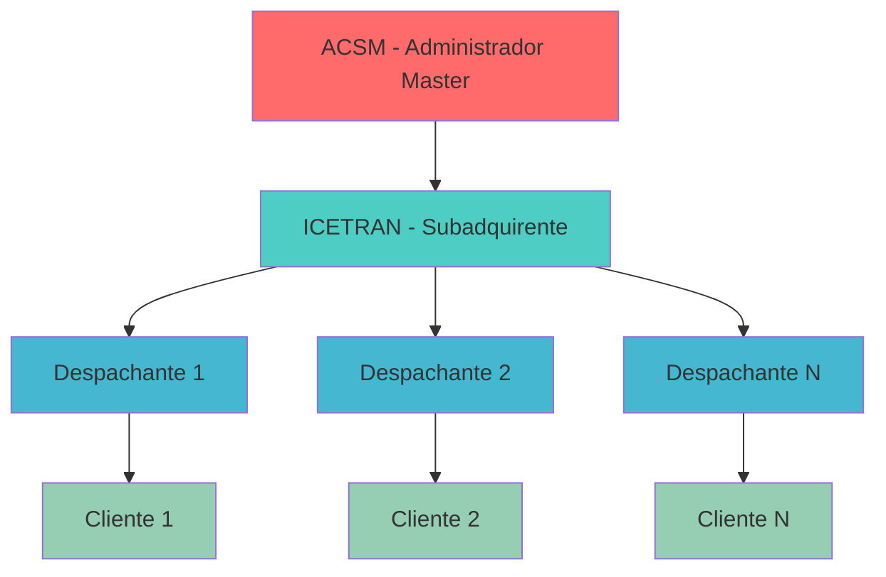
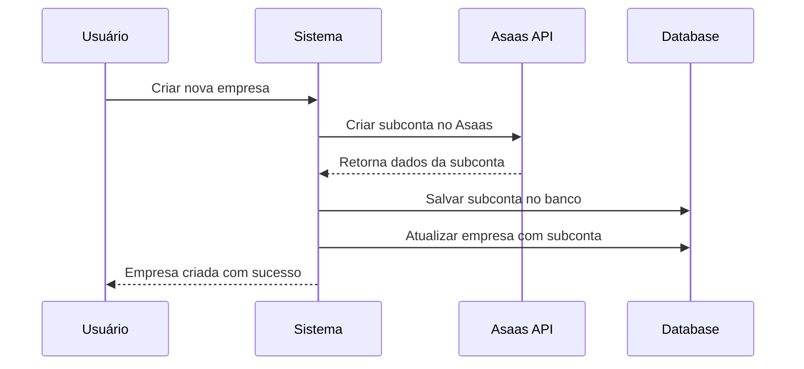
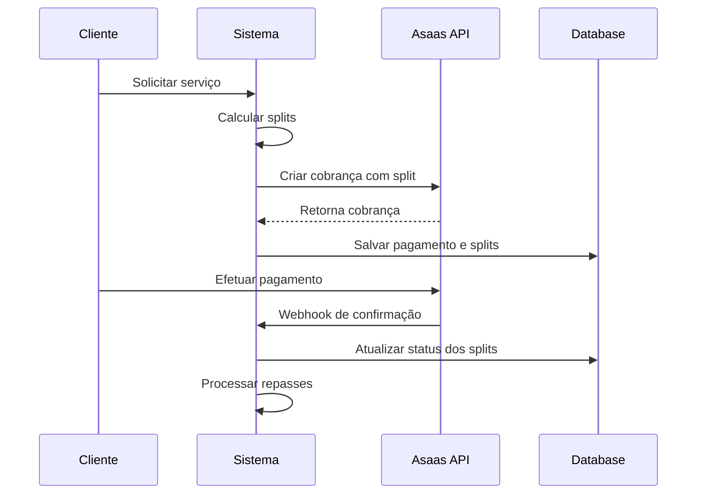

# Sistema de Subcontas Asaas com Split de Pagamentos

## 1. Visão Geral do Sistema

### Estrutura Hierárquica



### Fluxo de Pagamentos

1. **Cliente** paga o valor total do serviço
2. **ACSM** recebe o pagamento integral
3. **Sistema** executa split automático:
   - Percentual para **ICETRAN**
   - Percentual para **Despachante**
   - Percentual fica com **ACSM**

## 2. Estrutura de Banco de Dados

### 2.1 Novas Tabelas

#### Tabela: `asaas_subaccounts`
```sql
CREATE TABLE asaas_subaccounts (
    id UUID PRIMARY KEY DEFAULT gen_random_uuid(),
    company_id UUID NOT NULL REFERENCES companies(id) ON DELETE CASCADE,
    asaas_account_id VARCHAR(100) NOT NULL UNIQUE, -- ID da subconta no Asaas
    wallet_id VARCHAR(100) NOT NULL UNIQUE, -- Wallet ID para splits
    account_type VARCHAR(20) NOT NULL CHECK (account_type IN ('subadquirente', 'despachante')),
    status VARCHAR(20) DEFAULT 'active' CHECK (status IN ('active', 'inactive', 'suspended')),
    api_key VARCHAR(200), -- Chave API da subconta (se aplicável)
    webhook_url TEXT,
    created_at TIMESTAMPTZ DEFAULT now(),
    updated_at TIMESTAMPTZ DEFAULT now()
);

CREATE INDEX idx_asaas_subaccounts_company_id ON asaas_subaccounts(company_id);
CREATE INDEX idx_asaas_subaccounts_wallet_id ON asaas_subaccounts(wallet_id);
```

#### Tabela: `split_configurations`
```sql
CREATE TABLE split_configurations (
    id UUID PRIMARY KEY DEFAULT gen_random_uuid(),
    service_type VARCHAR(50) NOT NULL, -- 'recurso', 'assinatura_acompanhamento'
    acsm_percentage DECIMAL(5,2) NOT NULL DEFAULT 30.00, -- % para ACSM
    icetran_percentage DECIMAL(5,2) NOT NULL DEFAULT 20.00, -- % para ICETRAN
    despachante_percentage DECIMAL(5,2) NOT NULL DEFAULT 50.00, -- % para Despachante
    is_active BOOLEAN DEFAULT true,
    created_at TIMESTAMPTZ DEFAULT now(),
    updated_at TIMESTAMPTZ DEFAULT now(),
    
    CONSTRAINT check_split_total CHECK (
        acsm_percentage + icetran_percentage + despachante_percentage = 100.00
    )
);
```

#### Tabela: `payment_splits`
```sql
CREATE TABLE payment_splits (
    id UUID PRIMARY KEY DEFAULT gen_random_uuid(),
    payment_id UUID NOT NULL REFERENCES asaas_payments(id),
    recipient_type VARCHAR(20) NOT NULL CHECK (recipient_type IN ('acsm', 'icetran', 'despachante')),
    recipient_company_id UUID REFERENCES companies(id),
    wallet_id VARCHAR(100), -- Wallet ID do destinatário
    split_percentage DECIMAL(5,2) NOT NULL,
    split_amount DECIMAL(10,2) NOT NULL,
    status VARCHAR(20) DEFAULT 'pending' CHECK (status IN ('pending', 'processed', 'failed')),
    asaas_split_id VARCHAR(100), -- ID do split no Asaas
    created_at TIMESTAMPTZ DEFAULT now(),
    updated_at TIMESTAMPTZ DEFAULT now()
);

CREATE INDEX idx_payment_splits_payment_id ON payment_splits(payment_id);
CREATE INDEX idx_payment_splits_recipient ON payment_splits(recipient_company_id);
```

### 2.2 Alterações em Tabelas Existentes

#### Tabela: `companies`
```sql
-- Adicionar campos para subcontas
ALTER TABLE companies ADD COLUMN asaas_subaccount_id UUID REFERENCES asaas_subaccounts(id);
ALTER TABLE companies ADD COLUMN parent_company_id UUID REFERENCES companies(id); -- Para hierarquia
ALTER TABLE companies ADD COLUMN company_level VARCHAR(20) DEFAULT 'despachante' 
    CHECK (company_level IN ('master', 'subadquirente', 'despachante'));

CREATE INDEX idx_companies_parent ON companies(parent_company_id);
CREATE INDEX idx_companies_level ON companies(company_level);
```

#### Tabela: `asaas_payments`
```sql
-- Adicionar campos para split
ALTER TABLE asaas_payments ADD COLUMN has_split BOOLEAN DEFAULT false;
ALTER TABLE asaas_payments ADD COLUMN split_status VARCHAR(20) DEFAULT 'none' 
    CHECK (split_status IN ('none', 'pending', 'processed', 'failed'));
ALTER TABLE asaas_payments ADD COLUMN total_split_amount DECIMAL(10,2);
```

## 3. APIs e Serviços

### 3.1 Serviço de Subcontas (`subaccountService.ts`)

```typescript
export interface AsaasSubaccount {
  id?: string;
  company_id: string;
  asaas_account_id: string;
  wallet_id: string;
  account_type: 'subadquirente' | 'despachante';
  status: 'active' | 'inactive' | 'suspended';
  api_key?: string;
  webhook_url?: string;
}

export interface SubaccountCreateData {
  name: string;
  email: string;
  cpfCnpj: string;
  mobilePhone?: string;
  address?: {
    postalCode: string;
    address: string;
    addressNumber: string;
    province: string;
    city: string;
    state: string;
  };
  companyType?: string;
  phone?: string;
  site?: string;
}

class SubaccountService {
  /**
   * Criar subconta no Asaas quando empresa é criada
   */
  async createSubaccount(companyId: string, subaccountData: SubaccountCreateData): Promise<AsaasSubaccount> {
    // 1. Criar subconta via API Asaas
    const asaasResponse = await this.createAsaasSubaccount(subaccountData);
    
    // 2. Salvar dados da subconta no banco
    const subaccount = await this.saveSubaccountToDatabase({
      company_id: companyId,
      asaas_account_id: asaasResponse.id,
      wallet_id: asaasResponse.walletId,
      account_type: this.determineAccountType(companyId),
      status: 'active'
    });
    
    // 3. Atualizar empresa com referência da subconta
    await this.linkCompanyToSubaccount(companyId, subaccount.id);
    
    return subaccount;
  }

  /**
   * Criar subconta via API Asaas
   */
  private async createAsaasSubaccount(data: SubaccountCreateData) {
    const response = await fetch(`${this.getAsaasBaseUrl()}/accounts`, {
      method: 'POST',
      headers: this.getAsaasHeaders(),
      body: JSON.stringify({
        name: data.name,
        email: data.email,
        cpfCnpj: data.cpfCnpj,
        mobilePhone: data.mobilePhone,
        address: data.address,
        companyType: data.companyType,
        phone: data.phone,
        site: data.site
      })
    });

    if (!response.ok) {
      throw new Error(`Erro ao criar subconta no Asaas: ${response.statusText}`);
    }

    return await response.json();
  }

  /**
   * Determinar tipo de conta baseado na hierarquia
   */
  private async determineAccountType(companyId: string): Promise<'subadquirente' | 'despachante'> {
    const { data: company } = await supabase
      .from('companies')
      .select('company_level')
      .eq('id', companyId)
      .single();

    return company?.company_level === 'subadquirente' ? 'subadquirente' : 'despachante';
  }
}
```

### 3.2 Serviço de Split (`splitService.ts`)

```typescript
export interface SplitConfiguration {
  service_type: string;
  acsm_percentage: number;
  icetran_percentage: number;
  despachante_percentage: number;
}

export interface PaymentSplit {
  recipient_type: 'acsm' | 'icetran' | 'despachante';
  recipient_company_id?: string;
  wallet_id: string;
  split_percentage: number;
  split_amount: number;
}

class SplitService {
  /**
   * Calcular splits para um pagamento
   */
  async calculateSplits(
    paymentAmount: number,
    serviceType: string,
    despachanteCompanyId: string
  ): Promise<PaymentSplit[]> {
    // 1. Buscar configuração de split
    const config = await this.getSplitConfiguration(serviceType);
    
    // 2. Buscar dados das empresas na hierarquia
    const hierarchy = await this.getCompanyHierarchy(despachanteCompanyId);
    
    // 3. Calcular valores dos splits
    const splits: PaymentSplit[] = [
      {
        recipient_type: 'acsm',
        wallet_id: hierarchy.acsm.wallet_id,
        split_percentage: config.acsm_percentage,
        split_amount: (paymentAmount * config.acsm_percentage) / 100
      },
      {
        recipient_type: 'icetran',
        recipient_company_id: hierarchy.icetran.id,
        wallet_id: hierarchy.icetran.wallet_id,
        split_percentage: config.icetran_percentage,
        split_amount: (paymentAmount * config.icetran_percentage) / 100
      },
      {
        recipient_type: 'despachante',
        recipient_company_id: despachanteCompanyId,
        wallet_id: hierarchy.despachante.wallet_id,
        split_percentage: config.despachante_percentage,
        split_amount: (paymentAmount * config.despachante_percentage) / 100
      }
    ];

    return splits;
  }

  /**
   * Processar splits no Asaas
   */
  async processSplits(paymentId: string, splits: PaymentSplit[]): Promise<void> {
    // 1. Salvar splits no banco
    await this.saveSplitsToDatabase(paymentId, splits);
    
    // 2. Executar splits via API Asaas (se necessário)
    // Nota: Splits são configurados na criação do pagamento
    
    // 3. Atualizar status do pagamento
    await this.updatePaymentSplitStatus(paymentId, 'processed');
  }

  /**
   * Buscar hierarquia da empresa
   */
  private async getCompanyHierarchy(despachanteId: string) {
    const { data } = await supabase
      .from('companies')
      .select(`
        *,
        asaas_subaccounts(*),
        parent:companies!parent_company_id(*,asaas_subaccounts(*))
      `)
      .eq('id', despachanteId)
      .single();

    return {
      despachante: {
        id: data.id,
        wallet_id: data.asaas_subaccounts[0]?.wallet_id
      },
      icetran: {
        id: data.parent?.id,
        wallet_id: data.parent?.asaas_subaccounts[0]?.wallet_id
      },
      acsm: {
        wallet_id: process.env.ACSM_WALLET_ID // Configurado nas variáveis de ambiente
      }
    };
  }
}
```

### 3.3 Atualização do AsaasService

```typescript
// Adicionar ao AsaasService existente

/**
 * Criar pagamento com split automático
 */
async createPaymentWithSplit(
  paymentData: AsaasPaymentCreate,
  despachanteCompanyId: string,
  serviceType: string
): Promise<AsaasPayment> {
  // 1. Calcular splits
  const splits = await splitService.calculateSplits(
    paymentData.value,
    serviceType,
    despachanteCompanyId
  );

  // 2. Adicionar splits ao pagamento
  const paymentWithSplit = {
    ...paymentData,
    split: splits.map(split => ({
      walletId: split.wallet_id,
      fixedValue: split.split_amount
    }))
  };

  // 3. Criar pagamento no Asaas
  const payment = await this.createPayment(paymentWithSplit);

  // 4. Processar splits no sistema
  await splitService.processSplits(payment.id, splits);

  return payment;
}
```

## 4. Fluxo de Implementação

### 4.1 Criação de Empresa



### 4.2 Processamento de Pagamento



## 5. Configurações Necessárias

### 5.1 Variáveis de Ambiente

```env
# Asaas Master Account
ACSM_WALLET_ID=wallet_id_da_conta_master
ACSM_API_KEY=api_key_da_conta_master

# Split Configurations
DEFAULT_ACSM_PERCENTAGE=30
DEFAULT_ICETRAN_PERCENTAGE=20
DEFAULT_DESPACHANTE_PERCENTAGE=50
```

### 5.2 Configuração Inicial

```sql
-- Inserir configurações padrão de split
INSERT INTO split_configurations (service_type, acsm_percentage, icetran_percentage, despachante_percentage) VALUES
('recurso', 30.00, 20.00, 50.00),
('assinatura_acompanhamento', 25.00, 25.00, 50.00);

-- Configurar ICETRAN como subadquirente
UPDATE companies SET company_level = 'subadquirente' WHERE nome = 'ICETRAN';
```

## 6. Considerações de Segurança

### 6.1 Validações
- Verificar se empresa tem subconta antes de processar pagamentos
- Validar percentuais de split (devem somar 100%)
- Verificar hierarquia de empresas antes de criar splits

### 6.2 Logs e Auditoria
- Registrar todas as operações de criação de subcontas
- Log de todos os splits processados
- Auditoria de alterações em configurações de split

### 6.3 Tratamento de Erros
- Rollback em caso de falha na criação de subconta
- Retry automático para splits falhados
- Notificações para administradores em caso de erros

## 7. Testes

### 7.1 Testes Unitários
- Cálculo de splits
- Validação de hierarquia
- Criação de subcontas

### 7.2 Testes de Integração
- Fluxo completo de criação de empresa
- Processamento de pagamento com split
- Webhooks do Asaas

### 7.3 Testes End-to-End
- Cenário completo: criação de empresa → cobrança → pagamento → split
- Validação de valores recebidos por cada parte

## 8. Monitoramento

### 8.1 Métricas
- Taxa de sucesso na criação de subcontas
- Tempo de processamento de splits
- Volume de transações por empresa

### 8.2 Alertas
- Falhas na criação de subcontas
- Splits não processados
- Discrepâncias nos valores

## 9. Roadmap de Implementação

### Fase 1: Estrutura Base (2 semanas)
- [ ] Criar tabelas de banco de dados
- [ ] Implementar SubaccountService
- [ ] Testes unitários básicos

### Fase 2: Split de Pagamentos (2 semanas)
- [ ] Implementar SplitService
- [ ] Atualizar AsaasService
- [ ] Integração com API Asaas

### Fase 3: Interface e Configuração (1 semana)
- [ ] Telas de configuração de splits
- [ ] Dashboard de monitoramento
- [ ] Relatórios financeiros

### Fase 4: Testes e Deploy (1 semana)
- [ ] Testes end-to-end
- [ ] Deploy em ambiente de produção
- [ ] Monitoramento e ajustes

## 10. Considerações Finais

Este sistema permitirá:
- **Automatização completa** do processo de splits
- **Transparência** nos repasses financeiros
- **Escalabilidade** para novos despachantes
- **Controle centralizado** pela ACSM
- **Flexibilidade** na configuração de percentuais

A implementação seguirá as melhores práticas de segurança e auditoria, garantindo a integridade das transações financeiras e a rastreabilidade completa dos repasses.